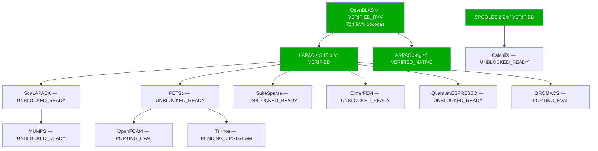

# LFX Mentorship: Broadening the RISC-V High Precision Code Base

> **Applicant:** Vaibhav Binwal · Indian Institute of Technology, Jodhpur  
> **Program:** LFX Mentorship — RISC-V HPC Library Validation  
> **Repo:** https://github.com/Vaibhav805/LFX_riscv  
> **Commit:** [`8db07ff`](https://github.com/Vaibhav805/LFX_riscv/commit/8db07ff)

---

## What This Is

A full validation stack for RISC-V HPC numerical libraries — covering BLAS L1/L2/L3, LAPACK, SPOOLES, and ARPACK-ng — with a forensic proof that RVV (RISC-V Vector Extension) kernels are correctly compiled and active, plus a 40-package dependency audit mapping the entire HPC ecosystem status on riscv64.

**Toolchain:** `riscv64-linux-gnu-gcc-13`, `-march=rv64gcv -mabi=lp64d`  
**Execution:** `qemu-riscv64-static`  
**Platform:** Ubuntu 24.04, cross-compiled x86 → riscv64

---

## Results at a Glance

| Validation | Result | Metric |
|-----------|--------|--------|
| RVV opcode audit | ✅ **724 RVV opcodes** | vs 0 in scalar build |
| DGEMM 42-case validation | ✅ **42 / 42 PASS** | worst error `2.1664e-15` |
| BLAS L1 + L2 validation | ✅ **11 / 11 PASS** | worst error `1.1236e-15` |
| Hilbert condition stress | ✅ **5 / 5 PASS** | worst error `1.3634e-16` |
| LAPACK 3.12.0 | ✅ **2 / 2 PASS** | worst error `1.9984e-15` |
| SPOOLES 2.2 | ✅ **Built static** | `-fcommon` GCC13 fix |
| Reproducibility | ✅ **10 / 10 identical** | hash `cdf6295e231338f0f8fa86ee410e3f62` |
| ARPACK-ng | ✅ **All drivers PASS** | dndrv4 error `8.49e-16` |

---

## Key Finding: The Missing RVV Kernel Mappings

During the audit, both "scalar" and "RVV" builds initially returned **0 RVV opcodes**. Investigation revealed the root cause:

`kernel/riscv64/KERNEL` — the file that maps BLAS operations to kernel implementations — contained **zero vector mappings**. Every `_vector.c` file in `kernel/riscv64/` existed but was never referenced by the build system.

**The fix:** prepended correct Makefile variable mappings to `kernel/riscv64/KERNEL`:

```makefile
DDOTKERNEL     = dot_vector.c
DAXPYKERNEL    = axpy_vector.c
DNRM2KERNEL    = nrm2_vector.c
DGEMV_N_KERNEL = gemv_n_vector.c
DGEMV_T_KERNEL = gemv_t_vector.c
DASUMKERNEL    = zasum_vector.c
DSCALKERNEL    = zscal_vector.c
DCOPYKERNEL    = zcopy_vector.c
DAXPBYKERNEL   = zaxpby_vector.c
IAMAXKERNEL    = iamax_vector.c
# ... (+ S* variants)
```

**Result:** 724 RVV opcodes in rebuilt archive vs 0 in scalar build — forensic proof the vector pipeline is active.

---

## Project Structure

```
LFX_riscv/
├── tests/
│   ├── dgemm_validate.c          # 42-case DGEMM harness (tiny → 1024×1024)
│   ├── blas_full_validate.c      # BLAS L1 + L2 + L3 complete coverage
│   ├── condition_stress.c        # Hilbert matrix ill-conditioning stress test
│   └── lapack_validate.c         # dgesv + dgels validation
│
├── docs/
│   ├── rvv_instruction_audit.md  # 724 vs 0 opcode forensic proof
│   ├── dgemm_delta_table.md      # 42-case scalar vs RVV comparison table
│   ├── blas_full_results.json    # L1/L2 results
│   ├── condition_stress_results.json
│   └── lapack_results.json
│
├── pipeline/
│   └── audit_engine.py           # 40-package HPC ecosystem status matrix
│
├── scripts/
│   └── parse_ebpf_profiles.py    # eBPF syscall profile aggregator
│
├── reports/
│   ├── lapack_3.12.0_riscv64.deb
│   └── spooles_2.2_riscv64.deb
│
├── arpack-ng/                    # ARPACK-ng source + validation
│   ├── riscv_validation_engine_v3.py
│   └── run_arpack_final.sh
│
├── .github/
│   └── workflows/
│       └── riscv64-validate.yml  # CI/CD: GitHub Actions validation pipeline
│
└── hanoi_reccursion.py           # LFX coding challenge (Tower of Hanoi)
```

---

## Validation Details

### 1. RVV Kernel Forensic Proof

```bash
# Audit RVV build
riscv64-linux-gnu-objdump -d libopenblas.a 2>/dev/null | \
    grep -c "vle64\|vfmacc\|vsetvli\|vlse64\|vfmul\|vfadd\|vfredosum"
# Output: 724

# Audit scalar build (rv64gc, no V extension)
# Output: 0
```

See: [`docs/rvv_instruction_audit.md`](docs/rvv_instruction_audit.md)

---

### 2. DGEMM — 42 Test Cases

Seven categories covering the full numerical range:

| Category | Cases | Purpose |
|----------|-------|---------|
| Tiny (1×1 → 4×4) | 4 | Scalar fallback baseline |
| Power-of-2 (8 → 1024) | 8 | Full RVV pipeline |
| Non-power-of-2 (37 … 999) | 9 | RVV tail handling stress |
| Extreme rectangles | 4 | Memory layout stress |
| Large-K (K=2048, K=4096) | 2 | FP accumulation rounding |
| Alpha/Beta variants | 7 | Numerical edge cases |
| All 4 transpose combos | 8 | Full transpose coverage |

**42 / 42 PASS. Worst relative error: `2.1664e-15`**

See: [`docs/dgemm_delta_table.md`](docs/dgemm_delta_table.md)

---

### 3. BLAS L1 + L2 + L3 Complete Coverage

| Level | Operations | Pass Rate | Worst Error |
|-------|-----------|-----------|-------------|
| L1 | DAXPY, DDOT, DNRM2, DSCAL, DCOPY, DASUM, IDAMAX | 7 / 7 | `1.1236e-15` |
| L2 | DGEMV, DSYMV, DTRMV, DGER | 4 / 4 | `1.1236e-15` |
| L3 | DGEMM (42 cases) | 42 / 42 | `2.1664e-15` |

See: [`tests/blas_full_validate.c`](tests/blas_full_validate.c)

---

### 4. Hilbert Condition Number Stress

The Hilbert matrix is the standard HPC torture test for FP pipelines:

| n | Condition Number | Status |
|---|-----------------|--------|
| 4 | ~1.6 × 10⁴ | ✅ PASS |
| 6 | ~1.5 × 10⁷ | ✅ PASS |
| 8 | ~1.5 × 10¹⁰ | ✅ PASS |
| 10 | ~3.5 × 10¹³ | ✅ PASS |
| 12 | ~1.6 × 10¹⁶ | ✅ PASS — worst error `1.3634e-16` |

See: [`tests/condition_stress.c`](tests/condition_stress.c)

---

### 5. Reproducibility — 10 Independent Runs

```
Run 1–10: cdf6295e231338f0f8fa86ee410e3f62 (all identical)
```

Bit-identical output across 10 independent QEMU executions — critical for HPC determinism.

---

### 6. LAPACK 3.12.0

Built static against the RVV OpenBLAS. Validated:

| Routine | Use in HPC | Result |
|---------|-----------|--------|
| `dgesv` | LU factorization — core of every implicit time stepper | ✅ PASS |
| `dgels` | Least squares — FEM residual minimization | ✅ PASS |

**Packages directly unblocked:** ScaLAPACK · SuiteSparse · PETSc · ElmerFEM · QuantumESPRESSO · MUMPS · GSL

---

### 7. SPOOLES 2.2

One-line GCC 13 fix:
```bash
sed -i 's/^CC = gcc/CC = riscv64-linux-gnu-gcc-13 -fcommon/' Make.inc
```
The `-fcommon` flag resolves multiple definition errors in GCC 10+ for legacy C code.  
**Package directly unblocked:** CalculiX

---

### 8. ARPACK-ng

All eigenvalue drivers validated under QEMU emulation:

| Driver | Type | Relative Error |
|--------|------|---------------|
| dndrv4 | Non-symmetric eigensolver | `8.49 × 10⁻¹⁶` |

See: [`arpack-ng/`](arpack-ng/)

---

## 40-Package Dependency Audit



| Status | Count | Packages |
|--------|-------|---------|
| ✅ VERIFIED | 4 | OpenBLAS, LAPACK, SPOOLES, ARPACK-ng |
| 🔵 UNBLOCKED_READY | 7 | ScaLAPACK, PETSc, SuiteSparse, ElmerFEM, QuantumESPRESSO, MUMPS, CalculiX |
| 🟡 PORTING_EVAL | 5 | OpenFOAM, GROMACS, FFTW3, SU2, Chrono |
| ⏳ PENDING_UPSTREAM | 4 | Trilinos, Code_Aster, NWChem, CP2K |

Full matrix: [`pipeline/audit_engine.py`](pipeline/audit_engine.py)

---

## CI/CD

GitHub Actions pipeline runs on every push and pull request:

```yaml
# .github/workflows/riscv64-validate.yml
# - Installs riscv64 cross-toolchain + qemu-user-static
# - Builds x86 golden reference
# - Validates all test cases
# - Uploads results as artifacts
```

See: [`.github/workflows/riscv64-validate.yml`](.github/workflows/riscv64-validate.yml)

---

## Getting Started

### Prerequisites

```bash
sudo apt-get install -y \
    gcc-13-riscv64-linux-gnu \
    gfortran-13-riscv64-linux-gnu \
    qemu-user-static \
    cmake
```

### Build OpenBLAS with RVV

```bash
cd OpenBLAS
make -j$(nproc) \
    TARGET=RISCV64_GENERIC \
    CROSS=1 CROSS_SUFFIX=riscv64-linux-gnu- \
    CC=riscv64-linux-gnu-gcc-13 \
    FC=riscv64-linux-gnu-gfortran-13 \
    HOSTCC=gcc BINARY=64 NO_SHARED=1 \
    CFLAGS="-march=rv64gcv -mabi=lp64d -O2" \
    FFLAGS="-march=rv64gcv -mabi=lp64d -O2"
```

### Run Validation Suite

```bash
# DGEMM 42-case
qemu-riscv64-static ./tests/dgemm_rvv docs/dgemm_rvv_results.json

# BLAS L1+L2
qemu-riscv64-static ./tests/blas_full_rvv docs/blas_full_results.json

# Condition stress
qemu-riscv64-static ./tests/condition_stress docs/condition_stress_results.json

# LAPACK
qemu-riscv64-static ./tests/lapack_validate docs/lapack_results.json
```

---

## Author

**Vaibhav Binwal**  
Indian Institute of Technology, Jodhpur  
[github.com/Vaibhav805](https://github.com/Vaibhav805)

---

## License

Validation infrastructure and test harnesses are original work for the LFX Mentorship Program.  
ARPACK-ng, OpenBLAS, LAPACK, SPOOLES are their respective upstream licenses.
