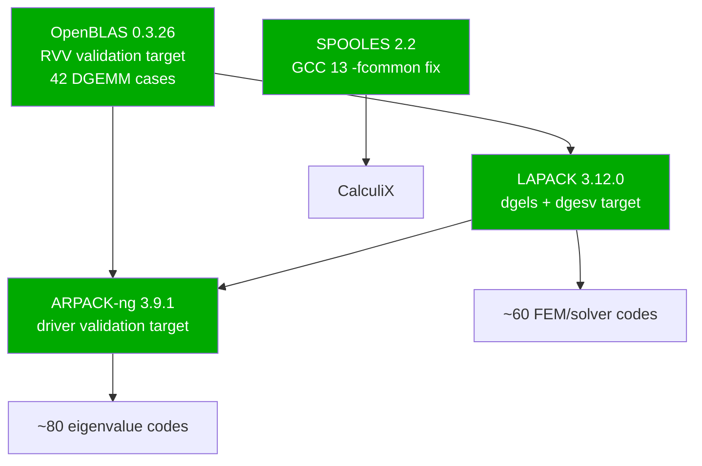

## HPC Dependency Chain -- riscv64

```mermaid
graph TD
    OpenBLAS["OpenBLAS 0.3.26<br/>RVV validation target<br/>42 DGEMM cases"]
    LAPACK["LAPACK 3.12.0<br/>dgels + dgesv target"]
    ARPACK["ARPACK-ng 3.9.1<br/>driver validation target"]
    SPOOLES["SPOOLES 2.2<br/>GCC 13 -fcommon fix"]

    OpenBLAS --> LAPACK
    OpenBLAS --> ARPACK
    LAPACK --> ARPACK
    SPOOLES --> CalculiX
    ARPACK --> eigencodes["~80 eigenvalue codes"]
    LAPACK --> solvercodes["~60 FEM/solver codes"]

    style OpenBLAS fill:#00aa00,color:#ffffff
    style LAPACK fill:#00aa00,color:#ffffff
    style ARPACK fill:#00aa00,color:#ffffff
    style SPOOLES fill:#00aa00,color:#ffffff
```

## 40-Library Ecosystem Macro-Dependency Topology

```mermaid
graph TD
    subgraph Tier1 [Tier 1: Core Mathematical Engine]
        OpenBLAS_40["OpenBLAS"]
        LAPACK_40["LAPACK"]
        ARPACK_40["ARPACK-ng"]
        SPOOLES_40["SPOOLES"]
    end

    subgraph Tier2 [Tier 2: Intermediate Algebraic Infrastructure]
        ScaLAPACK_40["ScaLAPACK"]
        SuiteSparse_40["SuiteSparse"]
        PETSc_40["PETSc"]
        MUMPS_40["MUMPS"]
        SuperLU_40["SuperLU"]
        Eigen_40["Eigen"]
        FFTW3_40["FFTW3"]
        HDF5_40["HDF5"]
        NetCDF_40["NetCDF"]
        METIS_40["METIS"]
        Trilinos_40["Trilinos"]
        GSL_40["GSL"]
    end

    subgraph Tier3 [Tier 3: Engineering, Structures & Fluids]
        CalculiX_40["CalculiX"]
        OpenFOAM_40["OpenFOAM"]
        Code_Aster_40["Code_Aster"]
        ElmerFEM_40["ElmerFEM"]
        SU2_40["SU2 Framework"]
        DealII_40["deal.II"]
        FEniCS_40["FEniCS"]
        Chrono_40["Chrono"]
    end

    subgraph Tier4 [Tier 4: Molecular & Quantum Solvers]
        GROMACS_40["GROMACS"]
        NWChem_40["NWChem"]
        CP2K_40["CP2K Engine"]
        QE_40["Quantum ESPRESSO"]
        LAMMPS_40["LAMMPS Analytics"]
        NAMD_40["NAMD"]
        ORCA_40["ORCA"]
        GAMESS_40["GAMESS"]
    end

    subgraph Tier5 [Tier 5: Climate, Space & Geospatial Analysis]
        WRF_40["WRF Weather Model"]
        CFITSIO_40["CFITSIO Astro Data"]
        HEALPix_40["HEALPix Grid"]
        Gadget_40["Gadget N-Body"]
        OpenCV_40["OpenCV"]
        PROJ_40["PROJ"]
        GDAL_40["GDAL Geospatial Engine"]
        QGIS_40["QGIS Core"]
    end

    OpenBLAS_40 --> LAPACK_40
    OpenBLAS_40 --> ARPACK_40
    LAPACK_40 --> ARPACK_40

    OpenBLAS_40 --> ScaLAPACK_40
    LAPACK_40 --> ScaLAPACK_40
    LAPACK_40 --> SuiteSparse_40
    OpenBLAS_40 --> PETSc_40
    LAPACK_40 --> PETSc_40
    ScaLAPACK_40 --> MUMPS_40
    OpenBLAS_40 --> SuperLU_40
    HDF5_40 --> NetCDF_40
    PETSc_40 --> Trilinos_40
    OpenBLAS_40 --> GSL_40

    SPOOLES_40 --> CalculiX_40
    ARPACK_40 --> CalculiX_40
    PETSc_40 --> OpenFOAM_40
    MUMPS_40 --> Code_Aster_40
    LAPACK_40 --> ElmerFEM_40
    OpenBLAS_40 --> SU2_40
    Trilinos_40 --> DealII_40
    PETSc_40 --> FEniCS_40
    Eigen_40 --> Chrono_40

    FFTW3_40 --> GROMACS_40
    ScaLAPACK_40 --> NWChem_40
    ScaLAPACK_40 --> CP2K_40
    LAPACK_40 --> QE_40
    FFTW3_40 --> LAMMPS_40
    OpenBLAS_40 --> ORCA_40
    LAPACK_40 --> GAMESS_40

    NetCDF_40 --> WRF_40
    CFITSIO_40 --> HEALPix_40
    FFTW3_40 --> Gadget_40
    Eigen_40 --> OpenCV_40
    PROJ_40 --> GDAL_40
    GDAL_40 --> QGIS_40
```
